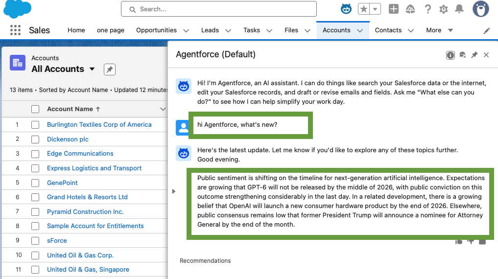
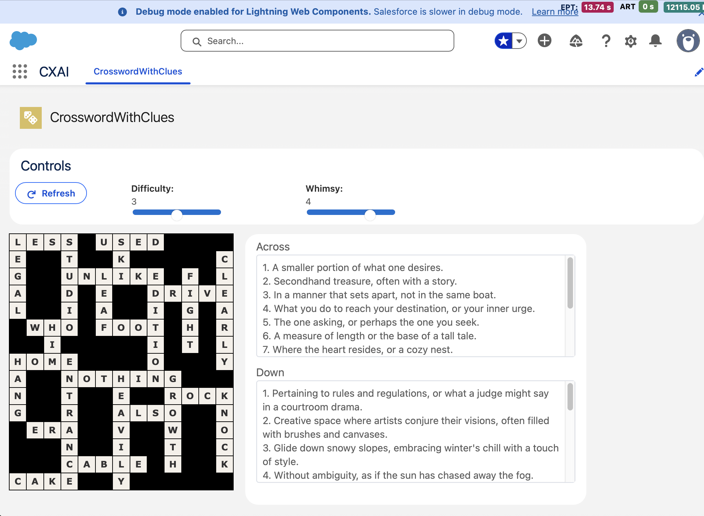
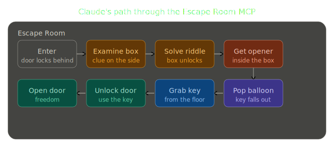
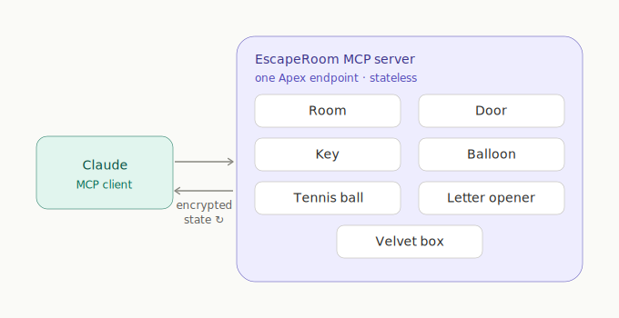
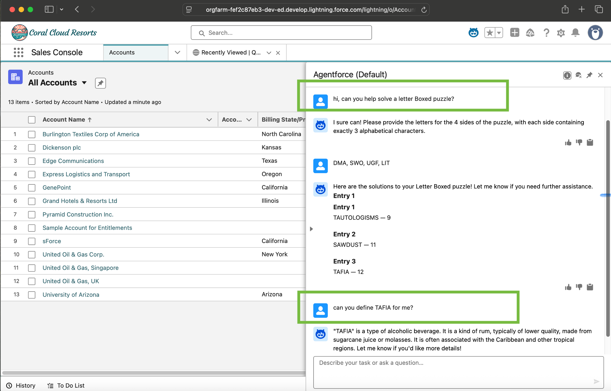

# Salesforce &amp; Agentforce AI Portfolio

<!-- Replace with your name and contact line -->
Sean Whalen— Salesforce engineering leader, ~10 years on the platform

Four independent projects demonstrating conversational AI on Salesforce: **Agentforce**, **Data Cloud / Data 360**, **Model Context Protocol (MCP)**, and **Retrieval-Augmented Generation (RAG)**. Each example comnbines a deterministic Apex or query engine with an LLM. The business logic is encapsulated, reusable, and testable. From the use's perspective the underlying technologies disappear.  

 
**Selected certifications** · Salesforce Platform Developer I · Agentforce Specialist · Agentforce Associate

> These are independent, personal projects in a Salesforce developer org. They exist to demonstrate AI capabilitie at different layers of Salesforce.

---

## Polymarket narrative — RAG over Data Cloud

An Apex scheduled job polls the Polymarket API hourly and posts each batch into Data 360 as time-series records containing text annotated with numeric metrics. When prompted by a user via Agentforce, the records matching a date filter are retrieved and handed to the Prompt Template as RAG context; the model reads the deltas between metric snapshots to decide which parts of the story to emphasize, producing a narrative summary weighted by what actually moved. It's an example of RAG from a Data Cloud store, with retrieval scoped by a time window.

**Demonstrates** · Agentforce · Data Cloud / Data 360 · RAG · scheduled Apex · REST integration

<!-- Write-up: add LinkedIn URL here -->

---

## Crossword generator (LWC) — procedural engine + Prompt Template clues

A Lightning Web Component fills a crossword grid using a classic backtracking search coded in Apex. It places words, validates that they fit together, and tries again if there is a problem. Alongside the grid, a Salesforce Prompt Template generates clues for the chosen words, using characteristics the user selects. A clue can be easy or cryptic, plain or whimsical. One LWC with two technologies: the procedural engine fits the words in place and the LLM describes them according to the user's guidance.

**Demonstrates** · Lightning Web Components · Prompt Builder / Prompt Templates · generative AI · deterministic-vs-LLM design

<!-- Write-up: add LinkedIn URL here -->

---

## MCP Escape Room — agentic tool use on Salesforce

A custom MCP server hosted in Salesforce that exposes seven tools implemented in Apex. The tools in the room are organized so the LLM client must discover each tool and leverage them all to get out of the room. State is communicated between calls as an encrypted token, so the server holds no session. Because the tool descriptions can be written to be clear or vague, the project can be used to observe how a model copes with different levels of ambiguity. Contrasting an LLM's probabilistic behavior against a strictly deterministic client running a fixed script is natural.

**Demonstrates** · Model Context Protocol · Apex-hosted tools (Headless-360-style exposure) · agentic orchestration · Anthropic Claude

<!-- Write-up: add LinkedIn URL here -->

---

## Letter Boxed solver — Agentforce over a SQL solver

Agentforce sits between the player and a large SQL query that solves the NYT Letter Boxed puzzle against a ~300,000-word dictionary held in Data 360. The agent turns the player's input into a parameter object, returns a solution, and then stays in the conversation. After the solution is returned, the user can ask for definitions or usage and get them back in natural language. Agentforce owns the natural-language UX while the word serach is done with Apex and SQL.

**Demonstrates** · Agentforce · Data Cloud / Data 360 · conversational AI · deterministic business logic

<!-- Write-up: add LinkedIn URL here -->

---

<!-- Optional: contact / LinkedIn / email line -->
